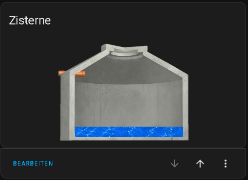

# Tank Level Card / Cistern Card by [@Gamer08YT](https://www.github.com/Gamer08YT)

[](https://my.home-assistant.io/redirect/hacs_repository/?owner=Gamer08YT&repository=hass-waterlevel&category=frontend) ![Project Maintenance][maintenance-shield]



## Configuration

A graphical user interface (GUI) to configure the card is currently not available.

After installation, simply press "Add Card", search for "Tank Level Card", and add the card.

## Options

| Name   | Type   | Requirement  | Description                         | Default    |
|--------|--------|--------------|-------------------------------------|------------|
| type   | string | **Required** | `custom:hass-waterlevel-card`       |            |
| entity | Entity | **Required** | Entity wich stores the Level State. |            |
| volume | Number | **Required** | Max Volume of your Tank.            | 1000       |
| title  | string | Optional     | Title of Card                       | Tank Level |

### Example configuration

```yaml
type: custom:hass-waterlevel-card
entity: sensor.füllstand
volume: 1000
```

## Install

### HACS

*This repo is available for install through the HACS.*

* Go to HACS → Frontend
* Use the FAB "Explore and download repositories" to search "Tank Level Card".

_or_

Click here:

[](https://my.home-assistant.io/redirect/hacs_repository/?owner=Gamer08YT&repository=hass-waterlevel&category=frontend)


[commits]: https://github.com/Gamer08YT/hass-waterlevel/commits/main

[maintenance-shield]: https://img.shields.io/maintenance/yes/2023.svg?style=for-the-badge

[releases]: https://github.com/Gamer08YT/hass-waterlevel/releases